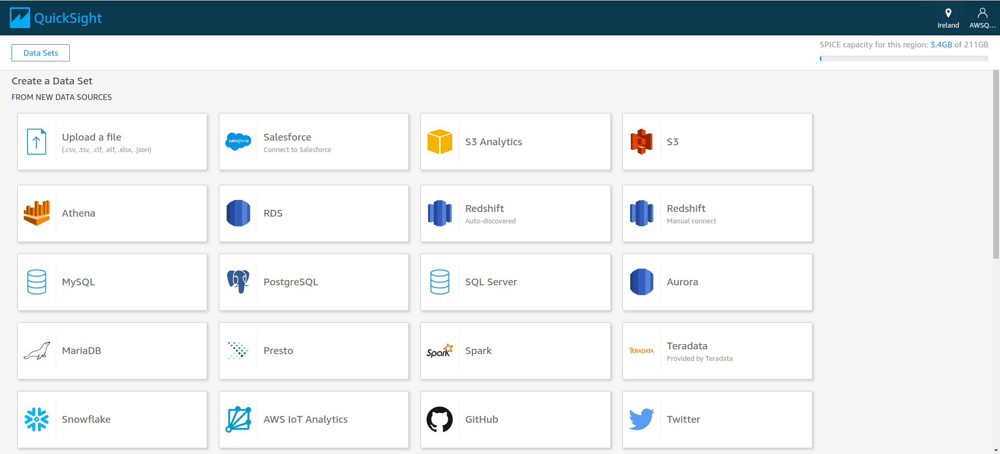

<h1>Augmenting QuickSight With Sagemaker  </h1>

> Using Amazon QuickSight with Amazon SageMaker models can save the time that you might otherwise spend managing data movement and writing code. The results are useful both for evaluating the model and—when you're satisfied with the results—for sharing with decision-makers. You can begin immediately after the model is built. Doing this surfaces your data scientists' prebuilt models, and enables you to apply the data science to your datasets. Then you can share these insights in your predictive dashboards. With the Amazon QuickSight serverless approach, the process scales seamlessly, so you don't need to worry about inference or query capacity. 

<h2>STEPS TO FOLLOW</h2>

 I am Taking Iris data set to make Predictions and Augment with sagemaker.

<h3> 1. Connect To Data or Upload Data.

<h3><i> <b>Note : Your Data Should not Contain Output Varible Column. When you Augment Sagameker with Quicksight , Model Predicts Input and appends output for the given Data.</h2>
<h3> 2. Go to Edit Settings and Prepare Data</b> </i></h3>

<h3> 3.Click Augment with SageMaker</h3>

<h3> 4. Select Your Model</h3>

<h3> 5. Upload Schema File</h3>

 It contains Details of Your Input, Output Variables and their  data types.

*  Data Type is DECIMAL if Data is Float.

*  Type is INTEGER if Data is Integer.

*  Type is STRING for String DataType.

<h3> 6. Correctly Map the Input and Output Data Fields</h3>

<h3> 7. Save and Visualize </h3>

<h3> 8. QuickSight Initiates a batch tranform job , predicts the output using Your Model and stores the result appended to your dataset in SPICE.</h3>

 Wait for Atleast 4 minutes to predict output and append.

<h3>9. Run it on a Schedule or programatically when your data updates.</h3>
<h3> 10 . You can Share The Dashboards or Insights to your clients easily. </h3>

<h3> References </h3>

<a href=https://docs.aws.amazon.com/quicksight/latest/user/sagemaker-integration.html> AWS Documentation </a>

<h2> Thank You :D </h2>

Hope you found it insightful. If you have any queries you can mail me at : <b> kumartharun435@gmail.com </b> .I would love to hear feedback from you to improvise it and make it better! 

